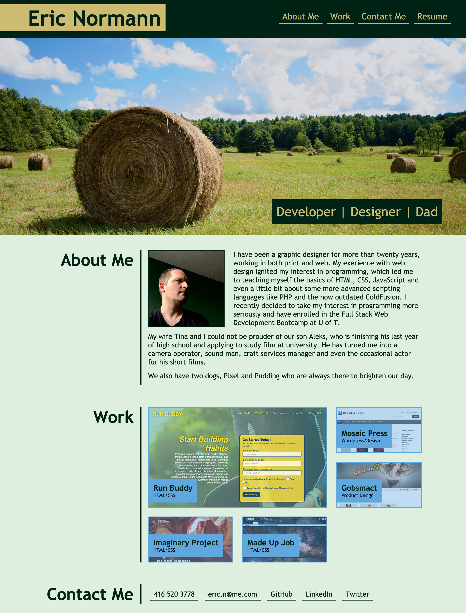

# Portfolio web page

## Description
Built a portfolio webpage with qand About Me, Work and Contact section as well as a link to my resume.
* Created a repository on github to host the portfolio page, cloned the repository to my local machine and created a develop branch to do the work
* Created plain HTML page with the information laid out in the appropriate order
* Created a style.css file add design elements to the page
* Used variables for colours
* Added pseudo-classses to CSS file to add mouse-over effects
* Added media queries to make the design work for different devices

## Screenshot

## Link to deployed webpage
[Eric Normann's Portfolio](https://e-p-n.github.io/)

